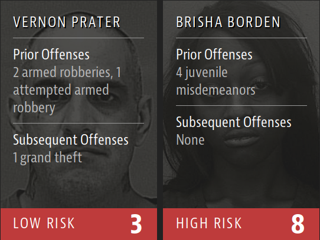
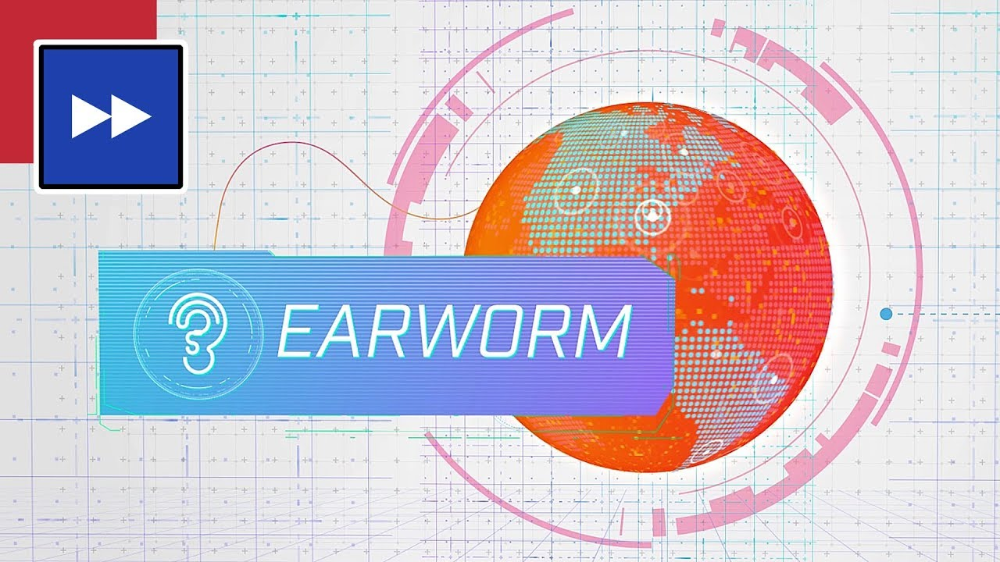

# Artificial Intelligence

--------------
--------------

**[BIAS IN MACHINE LEARNING NOTES](http://nickbriz.com/talks/bias-in-ai/)**

---------------------
--------------

## Algorithms

"computer scientists describe algorithms as a set of rules that define a sequence of operations. They're a series of instructions that tell a computer how it's supposed to solve a problem or achieve a certain goal. A good way to think of algorithms is by visualizing a flowchart." ...recall our "chocolate" vs "sour candy" game.

#### From NASA to Call Centers

"Conway wanted to build a bot that would know what callers wanted before they even asked for it. [...] Conway wanted to take humans out of it. Because it was a quantitative method, it was possible, Conway figured, to build bots that could read customers’ minds, “We are categorizing the human language,” he says. [...] The results were nothing short of astounding. When a caller reached a personality much like their own, calls lasted about five minutes and the problem was resolved 92 percent of the time. That’s high-quality customer service by any measure. When a customer’s call landed with an agent with an opposite personality, however, the difference was amazing: ten-minute calls and a 47 percent problem resolution rate. [...] With drastically shorter call times, a company like AT&T could eventually eliminate a third of its call center costs—provided that Conway could actually build the kinds of bots necessary to make it possible. As it turned out, it was very possible."

-- Christopher Steiner form his book "Automate This: How Algorithms Came to Rule Our World" Penguin Random House. 2012.

#### Efficiency

"It used to be, when you ordered something on the Internet, you waited a week for it to show up. That was the deal: you didn’t have to get off the couch, but you had to wait. But in the last few years, that’s changed. Now, increasingly, the stuff we buy on the Internet shows up the next day or the same day, sometimes within hours. Free shipping included. Which got us wondering: How is this Internet voodoo possible?"

-- from a 2014 RadioLab episode on how stuff you order on the Internet get's to your house, "[Brown Box](https://www.wnycstudios.org/story/brown-box)".

#### Algorithmic Policing

"On 4 August 2005, the police department of Memphis, Tennessee, made so many arrests over a three-hour period that it ran out of vehicles to transport the detainees to jail. Three days later, 1,200 people had been arrested across the city – a new police department record. Operation Blue Crush was hailed a huge success."

[...]

"Crush stands for "Criminal Reduction Utilizing Statistical History". Translated, it means predictive policing. Or, more accurately, police officers guided by algorithms. A team of criminologists and data scientists at the University of Memphis first developed the technique using IBM predictive analytics software. Put simply, they compiled crime statistics from across the city over time and overlaid it with other datasets – social housing maps, outside temperatures etc – then instructed algorithms to search for correlations in the data to identify crime "hot spots". The police then flooded those areas with highly targeted patrols."

-- from a Guardian Article,[ How algorithms rule the world](https://www.theguardian.com/science/2013/jul/01/how-algorithms-rule-world-nsa)

####  Taste Makers

"McCready ran as many to-be-released albums through his bot as possible. It was these test cases that would reveal if the algorithm had any real power. The algorithm rated most of the unreleased CDs as ho-hum. But one, the algorithm said, contained nine likely hits out of fourteen total songs. Those are Beatles numbers. McCready could hardly believe it. Nobody had heard of this artist, which made McCready worry that the bot was wildly wrong. But then the album, Come Away with Me, was released, selling more than twenty million copies and netting its artist, Norah Jones, eight Grammy Awards"

How it works... [demo](https://jsfiddle.net/)

## Machine Learning

How it works...

This image comes from [But what *is* a Neural Network?](https://www.youtube.com/watch?v=aircAruvnKk) a video by a great YouTube channel that breaks down concepts like this visually called [3Blue1Brown](https://www.youtube.com/channel/UCYO_jab_esuFRV4b17AJtAw). For another great info graphic on how ML works check out this blog post by R2D3 called [A visual introduction to machine learning](http://www.r2d3.us/visual-intro-to-machine-learning-part-1/)

#### Efficiency

"Google uses machine learning to understand how to optimize energy use at its data centers."

-- from [Google's Blog](https://googleblog.blogspot.com/2014/05/better-data-centers-through-machine.html)

#### Algorithmic Policing

"When the Chicago Police Department sent one of its commanders to Robert McDaniel’s home last summer, the 22-year-old high school dropout was surprised. Though he lived in a neighborhood well-known for bloodshed on its streets, he hadn’t committed a crime or interacted with a police officer recently. And he didn’t have a violent criminal record, nor any gun violations. In August, he incredulously told the Chicago Tribune, "I haven't done nothing that the next kid growing up hadn't done.” Yet, there stood the female police commander at his front door with a stern message: if you commit any crimes, there will be major consequences. We’re watching you."

-- from the Verge's article "[The minority report: Chicago's new police computer predicts crimes, but is it racist?](https://www.theverge.com/2014/2/19/5419854/the-minority-report-this-computer-predicts-crime-but-is-it-racist)"

"Scores like this — known as `risk assessments` — are increasingly common in courtrooms across the nation. They are used to inform decisions about who can be set free at every stage of the criminal justice system, from assigning bond amounts — as is the case in Fort Lauderdale — to even more fundamental decisions about defendants’ freedom. In Arizona, Colorado, Delaware, Kentucky, Louisiana, Oklahoma, Virginia, Washington and Wisconsin, the results of such assessments are given to judges during criminal sentencing."

-- from the ProPublica article "[Machine Bias](https://www.propublica.org/article/machine-bias-risk-assessments-in-criminal-sentencing)"

#### Taste Makers

"If we give you two songs you like and one you don’t, we’ve failed."

-- from the Verge's article "[Tastemaker: How Spotify’s Discover Weekly cracked human curation at internet scale](https://www.theverge.com/2015/9/30/9416579/spotify-discover-weekly-online-music-curation-interview)"

## The "Robot Apocalypse"

