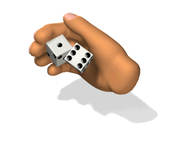

# What Is Code?


**code** (kōd)...

3.a. A system of signals used to represent letters or numbers in transmitting messages.

b. A system of symbols, letters, or words given certain arbitrary meanings, used for transmitting messages requiring secrecy or brevity.

4.a. A system of symbols and rules used to represent instructions to a computer...

—*The American Heritage Dictionary of the English Language*


Cuneiform numbers, one of the earliest known systems of writing:


> Numbers are certainly the most abstract codes we deal with on a regular basis. When we see the number 3 we don’t immediately need to relate it to anything. We might visualize 3 cats or 3 of something else, but we’d be just as comfortable learning from context that the numbers refers to a child’s birthday, a television channel, a hockey score, or the number of cups of flour in a cake recipe. Because our numbers are so abstract to begin with, it’s more difficult for us to understand that this number of cats: 🐱 🐱 🐱 doesn’t necessarily have to be denoted by the symbol

Petzold, Charles. CODE, The Hidden Language of Computer Hardware and Software. Microsoft Press. 2000.

## they're all symbols




```
♞ + ★ = ☢

☎ - ☯ = ?

☢ / ☀ = ?

♎ * ☀ = ?

☢ + ♞ = ?

♞ * ♞ = ?
```

## ten is arbitrary


## Numerical Representation (the raw data)

Inside the computer (especially the CPU) there's a microscopic tapestry of circuits. When the computer is on electricity oscillating between high and low voltages run throw these circuits. We generally refer to these as "bits" (short for binary digit), we call high voltages 1s and the low voltages 0s (ie. Binary Code). We often group these oscillations of voltages in groups of 8, which we call a "byte." These bytes can be used to represent any form of media.


In the interest of cross-platform compatibility (i.e. so you can share files from one computer to another regardless of what kind of computer it is) various organizations exist that create standards, an incomplete list of computer standards is available on [wikpedia](https://en.wikipedia.org/wiki/List_of_computer_standards). One of the oldest standards is ASCII (American Standard Code for Information Interchange), formalized in 1967, they standardized which numerical values would correspond to which characters.

raw data of a `.bmp` file:
```bash
42 4D
66 00 00 00 # file size (102 bytes)
00 00 00 00 # app reserved special purpose
36 00 00 00 # offset where image data is found (54 bytes)
28 00 00 00 # size of dib header (rest of header) (40b)
04 00 00 00 # width in pixels
04 00 00 00 # height in pixels
01 00 18 00 # color planes + number of bits per pixel (24bit = r8,g8,b8)
00 00 00 00 # compression method
30 00 00 00 # image data size (48b)
00 00 00 00 #
00 00 00 00 # misc
00 00 00 00 #
00 00 00 00 #
FF 00 FF FF 00 FF FF 00 FF FF 00 FF # raw pixel data
FF 00 FF FF 00 FF FF 00 FF FF 00 FF # ...from bottom up
FF 00 FF FF 00 FF FF 00 FF FF 00 FF # ...and right to left
FF 00 FF FF 00 FF FF 00 FF FF 00 FF #
```

[Databending Images in Audacity](https://www.hellocatfood.com/databending-using-audacity/) by Antonio Roberts (aka hellocatfood)


# Computer Languages

- [demo 1](images/icon1.png)
- [demo 2](images/icon2.png)
- [demo 3](images/icon3.png)

Working with [Machine Code](https://en.wikipedia.org/wiki/Machine_code) (or Machine Language) is the lowest level of abstraction, it maps 1-to-1 with what a computers circuits can process (how this happens will be explained next week). It's rare that humans write anything in Machine Code, instead we work with human readable computer languages higher up on the ladder of abstraction.

Different languages serve different purposes. The most common category, and the one we often think of when we think of "computer code" are [programming languages](https://en.wikipedia.org/wiki/Programming_language). Simply put, a programming language are instructions a human writes to get the computer to do what it wants. It's how we make video games and apps. There are plenty of different programming languages, each with their own syntax and specialty. Most of these languages are "general purpose", which means ultimately the can be used to make anything (regardless of their specialty). Below is the same program written in various languages.

```c
// C
#include <stdio.h>

void main(){

  int a = 84;
  int b = 12;
  int c = a + b;
  printf("%d\n", c );

}
```

```c
// C++
#include <iostream>

void main(){
{
  int a = 84;
  int b = 12;
  int c = a + b;
  std::cout << c;
}
```

```java
// Java

class myprogram
{
  public static void main(String args[])
  {
    int a = 84;
    int b = 12;
    int c = a + b;
    System.out.println(c);
  }
}
```
```php
<?php # php
  function main()
  {
    $a = 84;
    $b = 12;
    $c = $a + $b;
    echo $c."\n";
  }

  main();
?>
```

```JavaScript
// JavaScript (aka ECMAScript )

function main(){

  var a = 84;
  var b = 12;
  var c = a + b;
  console.log( c );
}

main();
```

```python
# Python

def main():
  a = 84
  b = 12
  c = a + b
  print(c)

main()
```

Programming languages are for humans to read and write, a computer can't actually process these instructions until it is converted into machine code by using a program called a "compiler" or "interpreter"


[Grace Hopper](https://en.wikipedia.org/wiki/Grace_Hopper)

## Document File Formats and Markup Languages

[Rich Text Format](https://en.wikipedia.org/wiki/Rich_Text_Format) (.rtf)
```rtf
{\rtf1\ansi{\fonttbl\f0\fswiss Helvetica;}\f0\pard
 This is some {\b bold} text.\par
 }
 ```

[Markdown](https://en.wikipedia.org/wiki/Markdown)
```md
This is some **bold** text.
```

[Hypertext Markup Language](https://en.wikipedia.org/wiki/HTML) (with a bit of [CSS](https://en.wikipedia.org/wiki/Cascading_Style_Sheets))
```html
<p style="font-family:Helvetica">
  This is some <b>bold</b> text.
</p>
```
