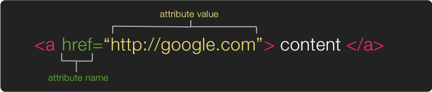

# Markup Languages

## markdown

```md
# This is a large heading
## this is a smaller heading
### even smaller

This is **bold** text, and this is **italicized** text. This is how you make a [hyperlink](https://en.wikipedia.org/wiki/Hyperlink) and ths is an example of a bit of `code`


```

Check out GitHub's [Markdown Cheatsheet](https://github.com/adam-p/markdown-here/wiki/Markdown-Cheatsheet) for more info and syntax.

## Hypertext Markup Language (HTML)

HTML is a kind of markup language. we use **HTML elements** in order to give our HTML page structure and organize our content. an element usually consists of a pair of tags, an opening tag has a `<` followed by characters that specify which tag it is, and then a `>`. The closing tag is the same except with `/` before the characters. between the opening `<tag>` and the closing `</tag>` is where we place our content.


a list of all the HTML elements can be found [here](https://developer.mozilla.org/en-US/docs/Web/HTML/Element)

Inside the opening tag ( between the `<tag` and the `>` ) you can include **attributes**. Attributes are used to add extra information about that particular element. The first part of an attribute is the attribute name. It indicates what kind of extra information your going to add to that element. These names are specific, always lower case and followed by a `=`. The second part of an attribute is the attribute value, this is the info or setting for this attribute, different elements can have different values, but they should always follow the `=` and be surrounded in `" "`.



 a list of all the attributes (and their corresponding elements) can be found [here](https://www.w3.org/TR/REC-html40/index/attributes.html)


When we're ready to create a new HTML page there are a few basic tags and structure that we should always start with (this can be considered a basic HTML template)


First, the `<!DOCTYPE html>`, this is a declaration that tells your browser that the code that follows conforms to the standards of a particular version of HTML, these used to be long and complicated (see previous [versions here](https://www.w3schools.com/tags/tag_doctype.asp) if you're curious) but with the latest version of HTML (HTML5) its short and sweet.

After that we've got our first official **element**, `<html>` the opening tag indicates that everything inbetween it and the closing `</html>` is going to be HTML code.

Inside of the HTML element there are two major elements, the `<head>` ... `</head>` which contains information about the page, and the `<body>` ... `</body>` which contains everything that will show up inside the browser window.

The only thing we absolutely need inside of our head element is a `<title> Page Title </title>`. You won't see this inside your browser window (because its not in the body) but will show up in lots of other places for example on your browser tab, and also in google search results.

Inside the body you include all of the elements that will create the structure of your content, for example you can create headers with `<h1>` ... `</h1>` and smaller headers with `<h2>` ... `</h2>` and you can create paragraph containers with` <p>` ... `</p>.


## SVG

The image file formats we looked at before are all "raster" images. This means they contain raw pixel data, essentially a grid of small colored blocks, like the kind of image you'd create on Photoshop. Images can also be "vector" files, which rather than containing raw pixel data, they contain information (like coordinates) the computer needs in order to create the image. These are the kinds of images you'd create on Illustrator.

```html
<svg width="300" height="200">
  <rect width="100%" height="100%" fill="red" />
  <circle cx="150" cy="100" r="90" fill="white" />
  <circle cx="150" cy="100" r="50" fill="red" />
  <circle cx="150" cy="100" r="25" fill="white" />
</svg>
```

Check out Mozilla's [SVG](https://developer.mozilla.org/en-US/docs/Web/SVG) reference page for more info.
