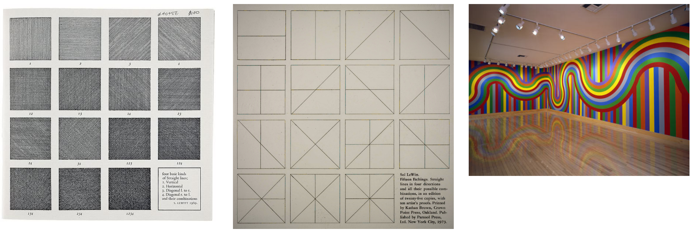
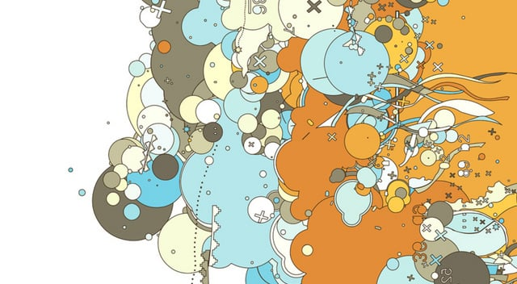
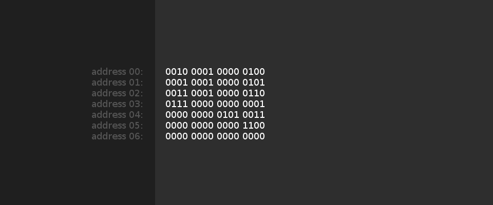
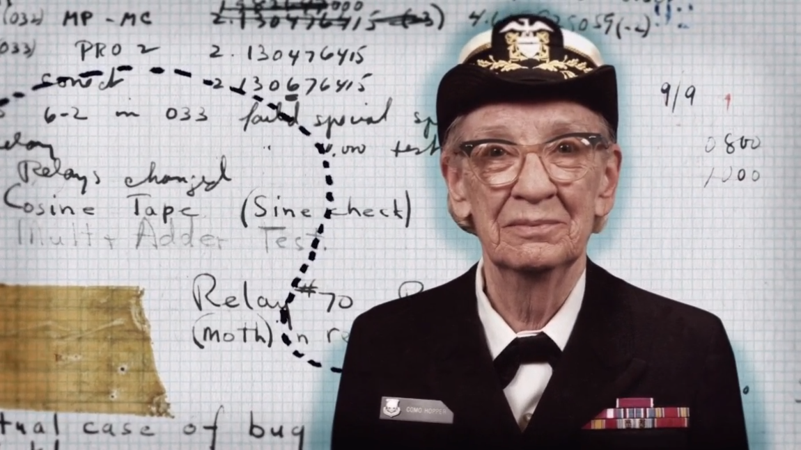
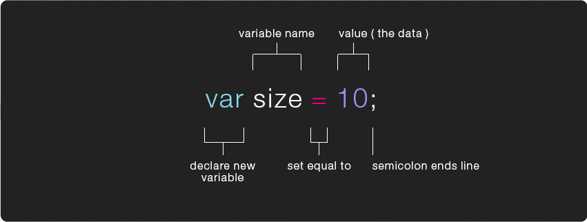
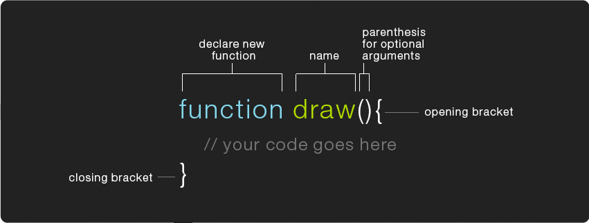

> Again, it [the Analytical Engine] might act upon other things besides number, were objects found whose mutual fundamental relations could be expressed by those of the abstract science of operations, and which should be also susceptible of adaptations to the action of the operating notation and mechanism of the engine . . . Supposing, for instance, that the fundamental relations of pitched sounds in the science of harmony and of musical composition were susceptible of such expression and adaptations, the engine might compose elaborate and scientific pieces of music of any degree of complexity or extent.  ⸺ *Ada Lovelace, from her notes on the [Analytical Engine](images/analyticalengine.jpg)*


# programming is like conceptual art

> The idea becomes a machine that makes the art ⸺ *Sol Lewitt*



what makes computers amazingly different from all the other machines that came before it is that it's "programmable". before computers machines were intrinsically tied to a specific function: a train was for moving stuff down a track, a camera was for taking photographs, a telegraph was for transmitting messages, these are very explicit mediums. a computer's purpose, however, depended on how u wired it up (or later, what u stored in it's memory) it is a "programmable" machine, it can become whatever u wanted it to be, a "[meta-medium](http://www.newmediareader.com/book_samples/nmr-26-kay.pdf)". while programming is a pretty refined craft at this point, at it's heart it's just about coming up w/different ways of leveraging the circuits in a computer, it's about coming up w/ideas that can be expressed in step by step "instructions." programs are concepts, though u can "save" or "store" a program in a memory stick or write it down on paper, the "file" itself isn't "the work" in the same way that the instructions written down on paper for Yoko Ono's instruction pieces wasn't "the work".


there's an established history of the [intertwingularity](https://en.wikipedia.org/wiki/Intertwingularity) between software && conceptual art. dating back to at least 1970 w/the show ["Software, Information Technology: Its New Meaning for Art"](http://www.fondation-langlois.org/html/e/page.php?NumPage=541) curated by Jack Burnham at the Jewish Museum in New York, && continuing to this day w/the work of artists like [Casey Reas](https://www.youtube.com/watch?v=_8DMEHxOLQE). ...but what do "instructions" look like for computers?


[](https://www.youtube.com/watch?v=_8DMEHxOLQE)

Casey Reas

[](https://vimeo.com/5950300)

Joshua Davis

# speaking the computer's "language"

again, it's important to remember the computer is a very specific (&& complex) arrangement of circuits in such a way that makes it possible for it to remember values && manipulate values (do math), but how does electricity become "values"? that's where Machine Code (or binary code) enters the picture. that electrical current is made up of high voltages && low voltages which we refer to as a 1 or a 0 (binary code) for the sake of being able to use these voltages to represent values or data.

[](https://youtu.be/1GSjbWt0c9M)

so binary code can be used to represent ANY data we choose && we can give the computer data in binary code to operate on, in the old days we would do that by flipping switches (on/off 1/0) or storing our data in punched cards/tape (whole-punch/no-whole-punch 1/0) && having the computer read the tape. we can also pass instructions for what we want the computer to do w/the data, computers are designed to (think "wired up to") interpret certain sequences of binary code as instruction codes (like "add" this, or "store" that), && so early programs could look something like this:

[](https://github.com/net-art-and-cultures/syllabus-and-notes/blob/master/notes/javascript/step-through-program/1.md)

programmers rarely ever dealt w/binary code directly, we made things easier by writing "assembly code" which were slightly more human readable versions of this machine code (which we would translate into binary before running), here's the same program in a hypothetical assembly language:

```

		ORG 0
		LDA A
		ADD B
		STA C
		HLT
	A,	DEC 84
	B,	DEC 12
	C,	DEC 0
		END
```

it's rare u find folks working in assembly these days (though some folks do, check out the cool 8bit art of [Rachel Weil](https://www.austinchronicle.com/screens/2012-05-04/8-bit-artisan/) for example) b/c if it's that complicated to tell a computer to add 2 numbers together it be virtually impossible to make it do much more complicated tasks (generally speaking, Rachel might disagree). add to that the fact that u need to know the instruction codes && "architecture" (how the switches are wired up) for every CPU design if u wanted ur program to work on every computer (the only computer Rachel worries about is the NES) + u'd have to re-write ur code each time, essentially u'd have to be quite the expert to do even really simple things... enter Grace Hopper:

[](http://netart.rocks/videos/grace-hopper.mp4)

this code is an example of [FLOW-MATIC](https://en.wikipedia.org/wiki/FLOW-MATIC) the first "english-like" compiled language developed under Admiral Hopper, which would eventually lead to COBOL, which is still used today. it's an obsolete language, but this is as close as i can approximate what it would have looked like to add to numbers together, let's assume the values 84 && 12 are stored in file A && B. admiral Hopper also popularized the idea of machine-independent programming languages which is generally how we think of programming languages today.

```
INPUT FIRST FILE=A SECOND FILE=B,
	OUTPUT SUM FILE=C;
	ADD A TO B
	TRANSFER B TO SUM
	CLOSE-OUT FILE SUM
	STOP.
```

today we have lots of "higher level" (of **abstraction**) languages meant to be written && read by humans. different languages specialize in different contexts (for example JavaScript is ideal for programming apps for the web) && they all have different "**syntax**" but ultimately they can all do the same things (JavaScript could be used to write pretty much anything, not just web apps). in order to use a language on any given system (particular computer architecture) u need to make sure someone has written a **compiler** or **interpreter** for that language on that system so that ur code can get translated to the machine code the computer needs in order to actually run ur program. here are a few more example of the same simple program written in a few different languages, notice their general similarity despite their difference in syntax

```c
// C
#include <stdio.h>

void main(){
  int a = 84;
  int b = 12;
  int c = a + b;
  printf("%d\n", c);
}
```


```java
// Java
class myprogram
{
  public static void main(String args[])
  {
    int a = 84;
    int b = 12;
    int c = a + b;
    System.out.println(c);
  }
}
```

```JavaScript
// JavaScript (aka ECMAScript)
function main(){
  let a = 84
  let b = 12
  let c = a + b
  console.log(c)
}

main()
```

```python
# Python
def main():
  a = 84
  b = 12
  c = a + b
  print(c)

main()
```

```php
<?php # php
  function main()
  {
    $a = 84;
    $b = 12;
    $c = $a + $b;
    echo $c."\n";
  }

  main();
?>
```

```c
// C++
#include <iostream>
void main(){
{
  int a = 84;
  int b = 12;
  int c = a + b;
  std::cout << c;
}
```

# JavaScript

> [Netscape, 1995] displayed Web pages that were not very lively. You could have a nice cartoon of a monkey on the Web page, but there was no way to make the monkey dance when you moved over it with your mouse. Figuring out how to make that happen was the job of a language developer named Brendan Eich. He sat down and in a few weeks created a language called JavaScript [...] as browsers proliferated and the Web grew from a document-delivery platform into a software-delivery platform, JavaScript became, arguably, the most widely deployed language runtime in the world. If you wrote some JavaScript code, you could run it wherever the Web was—everywhere. ⸺ *Paul Ford, from [What Is Code](http://www.bloomberg.com/graphics/2015-paul-ford-what-is-code/) in Bloomberg Business (2015)*


# how a "library" works

```js
var canvas = document.createElement('canvas');
	canvas.width = 600;
	canvas.height = 400;
	document.body.appendChild(canvas);
var ctx = canvas.getContext('2d');

// draw an ellipse
function ellipse(x,y,w,h){
    var kappa = 0.5522847498,
        ox = (w / 2) * kappa,
        oy = (h / 2) * kappa,
        xe = x + w,      
        ye = y + h,      
        xm = x + w / 2,  
        ym = y + h / 2;
      ctx.beginPath();
      ctx.moveTo(x, ym);
      ctx.bezierCurveTo(x, ym - oy, xm - ox, y, xm, y);
      ctx.bezierCurveTo(xm + ox, y, xe, ym - oy, xe, ym);
      ctx.bezierCurveTo(xe, ym + oy, xm + ox, ye, xm, ye);
      ctx.bezierCurveTo(xm - ox, ye, x, ym + oy, x, ym);
      ctx.closePath();
      ctx.fillStyle = "white";
      ctx.fill();
      ctx.stroke();
}

ellipse( 100, 100, 100, 50 );
```

vs

```js
function setup () {
  createCanvas(600, 400)
  ellipse( 100, 100, 100, 50 );
}
```

[](https://p5js.org)

## variables



## conditional statements

```js
  let age = 10
  if (age >= 21) {
    console.log('welcome to the bar.')
  } else {
    console.log('get out of here kid!')
  }
```

## loops

```js
let i = 0
while (i < 10) {
  console.log(i)
  i++
}
```

```js
for(let i = 0; i < 10; i++){
  console.log(i)
}
```

## functions


