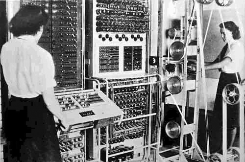

# Computers

## a brief (pre)history

**~1804**

When it comes to great inventions like the computer, there was never really a single author nor a clear beginning. The computer comes from a long line of calculating tools dating as far back as 2000 BCE. For the sake of starting somewhere we’ll start with the Jacquard loom, which—though not a calculating device itself—sowed the seed for the computer technology that followed.

**~1820-1840**

There’s nothing inherent to the concept of a computer that requires electricity (it just so happens that electric current flows pretty fast, which makes it useful for doing things really fast). But in theory we can reproduce a computers adding logic/functionality, for example, with (as we'll see later).

You could also (in theory) create a computer using gears and levers powered by steam, which is exactly what Charles Babbage designed in Victorian Era England, 100 years before the first computers were made. In a sense Babbage was the first computer engineer and his Analytical Engine (had it been completed) the first computer, capable of doing all the key things, as proven/articulated by Ada Lovelace who, in her Notes of the Analytical Engine, described how the Engine could be used to calculate all kinds of things. She detailed the specific instructions necessary for “programming” the Engine, in a sense making her the first computer programmer.

> Again, it [the Analytical Engine] might act upon other things besides number, were objects found whose mutual fundamental relations could be expressed by those of the abstract science of operations, and which should be also susceptible of adaptations to the action of the operating notation and mechanism of the engine . . . Supposing, for instance, that the fundamental relations of pitched sounds in the science of harmony and of musical composition were susceptible of such expression and adaptations, the engine might compose elaborate and scientific pieces of music of any degree of complexity or extent.

Lovelace, Ada. Sketch of the Analytical Engine. Bibliotheque Universelle de Geneve. 1842

** ~1840-1860**

###  Mathematical Analysis of Logic

<!--  -->

In 1847 George Boole published the pamphlet Mathematical Analysis of Logic. He later regarded it as a flawed exposition of his logical system, and wanted An Investigation of the Laws of Thought (1854), on Which are Founded the Mathematical Theories of Logic and Probabilities to be seen as the mature statement of his views. Contrary to widespread belief, Boole never intended to criticize or disagree with the main principles of Aristotle's logic. Rather he intended to systematize it, to provide it with a foundation, and to extend its range of applicability

'spectacular rags to prestige’ story, Boole was a Victorian era mathematician and logician; he didn’t know it at the time, but his ‘Boolean Algebra’ would lay the foundation for digital computers'

 ... AND ... OR ... NOT ...

** ~1880-1900 **

American inventor Herman Hollerith ran with the punched card idea as a means of creating machine-readable data storage. He invented the “tabulator” and the “keypunch” interface which used relays and digital counters to tackle the challenge of the US census (the population was growing faster than folks had time to manual tally stuff up). Hollerith’s company eventually became IBM.

 ~1930s

Hollerith's tabulator isn’t “technically” a computer. This is because it can’t do what a “Turing Machine” can do. A Turing Machine is a hypothetical machine that works as a criteria for what counts as a computer. It was conceptualized by one of the most brilliant mathematical minds in history, Alan Turing in his 1936 paper On Computable Numbers. Big thanks to Alan Turing for guiding us into a world full of computers and free of Nazis (more on that later this year).

###  symbolic (logic) Analysis of Circuits

A circuit is just a bunch of wires and components (resistors, transistors, diodes, etc.) connected together with electricity running through it, arranged in such a way that allows for simple or complex operations (from dimming a light bulbs to running robots).

"The real savior of Boolean logic was born a century after Boole: Claude Shannon, A Bell Labs engineer working with telephone switches. In his 1938 thesis, A Symbolic Analysis of Relay Switching Circuits, he laid out Boole's AND, OR, and NOT functions as electrical circuits—the first Logic Gates"

Claude Shannon is known as "The Father of Information Theory" for his landmark "Mathematical Theory of Communication" published in 1948. In it Shannon defined the limits of data transmission measured in bits per second, paving the way for the digital revolution.

In his 1937 master's thesis, Shannon laid the groundwork for electronic digital computing and practical digital circuit design by demonstrating the electrical application of Boolean algebra to resovle logical numerical relationships. Shannon built his maze-solving mouse, Theseus, in 1950.

###  German engineer Konrad Zuse, Z1, Z3

Zuse built his first computer (the Z1) with mechanical relays around the same time Claude Shannon && the other folks at Bell Labs were also discovering the computational possibilities of relays (though Bell Labs built experiments, they never quite built an entire computer, for this reason many consider the Z1 the first computer)

## Thinking Machines

**from relays to gates**

**diagram of a full adder**

**electric full adder**

**Arithmetic** via an electric 4Bit Adder (made of transistor gates, rather than relay gates or domino gates)

**Automation** via a "clock", oscillations made with transistors

**Memory** also cheived via transistor circuits

You could literally put all this stuff together and build your own computer from scratch, hobbyists [do it for fun](http://members.iinet.net.au/~daveb/simplex/ringhome.html) and lots of them [share their process](https://www.youtube.com/watch?v=HyznrdDSSGM&list=PLowKtXNTBypGqImE405J2565dvjafglHU). Of course there’s no real practical reason to do this. Let's instead put all the pieces together, theoretically.

It's helpful to remember, computers don't have to be electric, the concepts can be applied to any type of controllable signal.

## A Brief History of Computers

Moore's Law is the observation by Intel founder Gordon Moore that...
>the number of transistors that can be fitted onto a circuit doubles approximately every two years. This is why the computer you bought last year is now pathetically huge and lumbering compared to the sleek whizzy new one coming out next month."

Padua, Sydney. The Thrilling Adventures of Lovelace and Babbage. Pantheon Books. 2015.

1930’s early digital computing machines using relay’s
1940’s first computers with tubes
1950’s the transistor hits the scene
1960’s integrated circuit’s can hold few transistors
1970’s integrated circuit’s can hold thousands of transistors
1980’s integrated circuit’s can hold tens of thousands of transistors
1990’s integrated circuit’s can hold hundreds of thousands of transistors
2000’s integrated circuit’s can hold millions of transistors

Today a microprocessor (integrated circuit) that fits in the palm of your hand has got around 5 billion logic gates

** ~1943-1945 **

Programmers Betty Jean Jennings (left) and Fran Bilas (right) operate ENIAC's main control panel at the Moore School of Electrical Engineering. (U.S.)

A Colossus Mark 2 computer being operated by Wrens Dorothy Du Boisson (left) and Elsie Booker. (U.K.)

**  ~1945  **

John von Neumann was one of the key figures in formalizing and defining what would become known as the Von Neumann Architecture, the blueprints for what would be considered “a computer” henceforth. One major advancement from his design and the computers that came before it was the concept of a “stored-program.” A stored-program digital computers is one that keeps it’s program instructions (and it’s data) stored in RAM. The computers which came before this design were re-programmed—by re-setting switches or re-arranging patch cables—every time you wanted to use it. Re-programming the ENIAC could take up to 3 weeks.

** ~1948 **

It's argued that the first full-blown "stored-program" computer was built in 1948, the Manchestar "Baby" Mark I.

### "Dream Machines"

**  ~1970+ **

<!--  -->

Ivan Sutherland's early VR system

Ivan Sutherland's "Sketch Pad"

artist Lillian Schwartz using Sketch Pad

Douglas Engelbart delivers what was later known as The Mother of All Demos in 1968.

Dan Sandin and his Image Processor

Tom De Fanti and Dan Sandin

DeFanti's "GRASS" used in the first Star Wars film (1977)

IEVE : Interactive Electronic Visualization Event.

Held in the rotunda of the University of Illinois Circle Campus, Science and Engineering South building, EVL faculty, researcher, technologists, artists and collaborators from the Art Institute of Chicago created an interactive, real-time visualization experience or &ldquo:IEVE: Interactive Electronic Visualziation Event”".

One of a number of these events, IEVE combined computer graphics, created using Tom DeFanti’s GRASS language; video image processing produced using the Sandin Image Processor; and electronic, synthesized music composed and performed by Robert Snyder.

RYRAL is a realtime audio video performance by Tom DeFanti (creating computer animation with the GRaphics Symbiosis System or GRASS), Phil Morton ("up in the kitchen"), Dan Sandin (processing video with the Sandin Image Processor), Bob Snyder (performing experimental electronic music on an analog EMU synthesizer) and Rylin Harris (the dancer). This Media Art project was created and performed in April 1976 at the second Electronic Visualization Event (EVE II) at The University of Illinois Chicago.

RYRAL is provided by the Phil Morton Memorial Research Archive founded by jonCates in 2007. The Phil Morton Archive freely and openly releases materials under Morton's own COPY-IT-RIGHT license, a proto Open Source alternative to copyright. COPY-IT-RIGHT encourages making, sharing, remixing and distributing experimental Media Art.

The Dynabook, a speculative personal computer described in Alan Kay’s 1977 article "[Personal Dynamic Media](http://www.newmediareader.com/book_samples/nmr-26-kay.pdf)", co-authored with collaborator (and Smalltalk co-inventor) Adele Goldberg

### the "Personal Computer"

"The Intel 4004 is a 4-bit central processing unit (CPU) released by Intel Corporation in 1971. It was the first commercially available microprocessor by Intel" [wikipedia]

the Xerox Alto and SmallTalk-80

Steve Wozniak "Woz" and his Apple II

Icons from the Apple Macintosh

Susan Kare (Designer of the Apple Macintosh graphics)

...and now we've got iPhones
