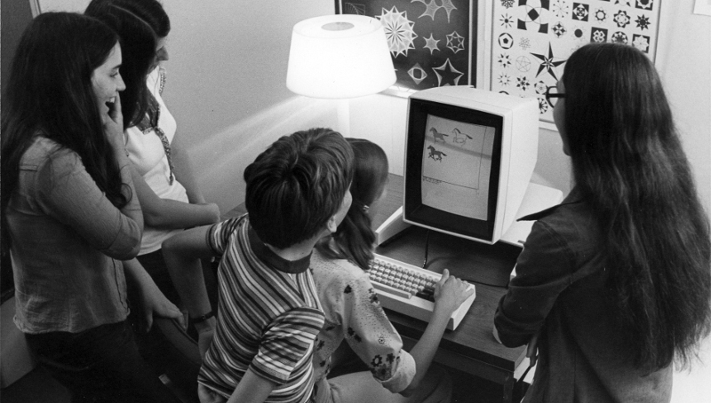
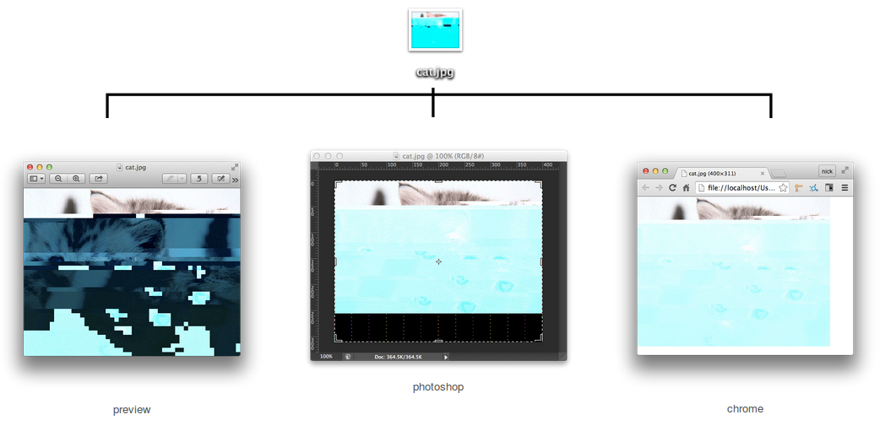
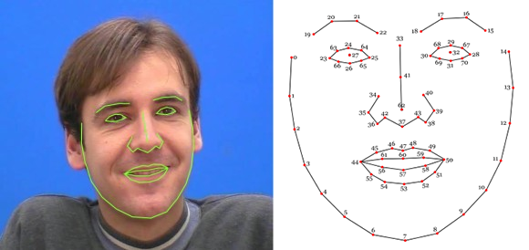
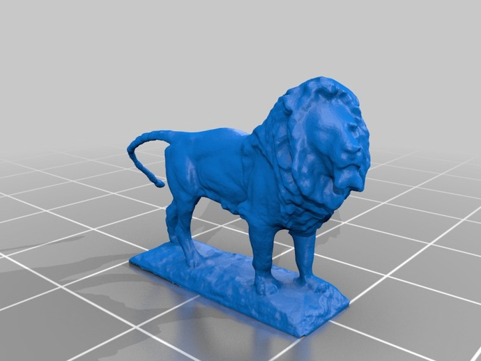
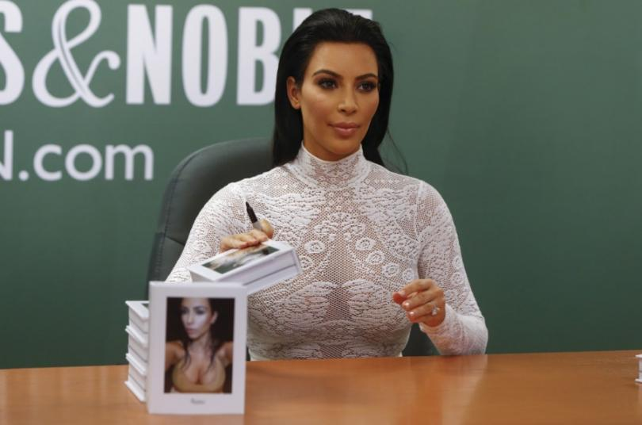
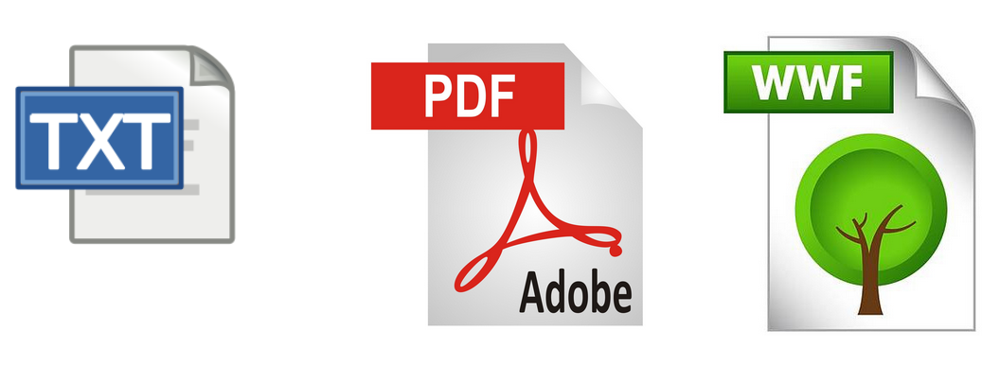

# Introduction to MetaMedia

## Digital Literacy

> ...when it comes to understanding the preliterate past, we modern folk are hopelessly automobolized. The written word is the mechanism by which we know what we know. It organizes our thought. We may wish to understand the rise of literacy both historically and logically, but history and logic are themselves the products of literate thought.

Gleick, James. The Information: A History, A Theory, A Flood. Pantheon Books. 2011.

Anthropologist and Digital Ethnographer Michael Wesch

Media Literay:

- [the Kuleshov Effect](https://en.wikipedia.org/wiki/Kuleshov_effect)
- [Edward Bernays](https://en.wikipedia.org/wiki/Edward_Bernays) public relations and propaganda

## MetaMedia

> The ability to ‘read’ a medium means you can access materials and tools generated by others. The ability to ‘write’ in a medium means you can generate materials and tools for others. You must have both to be literate.

Kay, Alan. "User Interface: A Personal View" 1989

students at Xerox PARC programming in early object-oriented programming language "Smalltalk" on the first "desktop" metaphor GUI computer: the Alto

Adele Goldberg presents Smalltalk

> Although digital computers were originally designed to do arithmetic computation, the ability to simulate the details of any descriptive model means that the computer, viewed as a medium itself, can be all other media if the embedding and viewing methods are sufficiently well provided. Moreover, this new “metamedium” is active—it can respond to queries and experiments—so that the message may involve the learner in a two-way conversation. (...) We think the implications are vast and compelling (...) a new kind of medium would have been created: a metamedium, whose content would be a wide range of already-existing and not-yet-invented media.

Kay, Alan & Adele Goldberg. "Personal Dynamic Computer" Computer 10(3):31-41. March 1977

#### ...'already-existing' media ...

> imagine that you live in the sixteenth century and you are told that you can order an image in a painting to travel by itself and appear in another painting in another country, or that a text in one book can lift itself and replace a text in another book? And yet this is exactly what many of us are doing every day without even thinking how magical this is.

Manovich, Lev. Software Takes Command. Bloomsbury Publishing. 2013.

When we experience new media we’re experiencing something part data and part algorithm, part object && part process. Take for example the glitched image of a cat (cat.jpg) viewed below through three different applications:

In one sense the computer is a “remediation machine”, capable of simulating older media within it. But when you digitize older media it becomes something else entirely. A digitized text for example can be **searched, copied, pasted**, etc. Once u turn traditional media into data you can algorithmically analyze it which, *"changes what it means to know something. (...) Algorithms and software applications that analyze images and video provide particularly striking examples of this capacity to generate additional information from the data years or even decades after it was recorded.”*

> (...)using data from different sources to create new knowledge that is not explicitly contained in any of them. For example, using the web sources, it is possible to create a comprehensive description of an individual by combining pieces of information from his/her various social media profiles and making deductions from them.

Manovich, Lev. Software Takes Command. Bloomsbury Publishing. 2013.

#### ...'not-yet-invented' media ...

**3D**

original Art Institute of Chicago Lions by Edward Kemeys (1893) [3D scan](https://www.thingiverse.com/thing:25832) by Tom Burtonwood (2012)

**VR**

**social media**

Like any new medium, these social networks have incubated new genres, from the collections of “feet, skies, found-art latte foam, selfies” on Instagram to “hauls” and “fail” videos on YouTube.

> The value of Instagram does not inhere in the images, pretty or ugly as you may find them. It’s in the deliriously complicated and heady circulation of those digital artifacts. The velocity. The trajectory. The way the ceaseless faster-than-light producing and transmitting, liking, tagging, commenting, and regramming can be leveraged for data mining and advertising in sets of encoded digital relations that make derivative securities look simple.

> If all three major American TV networks (NBC, CBS, and ABC ) had been broadcasting for twenty-four hours a day, seven days a week, for sixty years, they wouldn’t have created the amount of content uploaded to YouTube in two weeks.

Heffernan, Virginia. Magic and Loss: The Internet as Art. Simon & Schuster. 2016.

### the Internet

[one second on the Internet](http://www.internetlivestats.com/one-second/)

> the Internet [ noun \ˈin-tər-ˌnet\ ] a deeply misunderstood set of technologies upon which we increasingly depend

artist talk on Critical Exploits - Julian Oliver & Danja Vasiliev

> The Internet is the great masterpiece of human civilization. As an artifact it challenges the pyramid, the aqueduct, the highway, the novel, the newspaper, the nation-state, the Magna Carta, Easter Island, Stonehenge, agriculture, the feature film, the automobile, the telephone, the telegraph, the television, the Chanel suit, the airplane, the pencil, the book, the printing press, the radio, the realist painting, the abstract painting, the Pill, the washing machine, the skyscraper, the elevator, and cooked meat. As an idea it rivals monotheism.

Heffernan, Virginia. Magic and Loss: The Internet as Art. Simon & Schuster. 2016.

## Digital Ecology

> We shape our tools, thereafter our tools shape us

Marshall McLuhan

####  we shape our tools...

technology is not neutral; any given technology’s characteristics aren’t simply determined by its utilitarian agenda, they are also ( consciously or not ) symptomatic of their producer’s worldview

> The revealing that rules in modern technology is a challenging [Herausfordern], which puts to nature the unreasonable demand that it supply energy that can be extracted and stored as such. But does this not hold true for the old windmill as well? No. Its sails do indeed turn in the wind; they are left entirely to the wind's blowing. But the windmill does not unlock energy the air currents in order to store it. In contrast, a tract of land is challenged into the putting out of coal and ore. The earth now reveals itself as a coal mining district, the soil as a mineral deposit.

Heidegger, Martin. The Question Concerning Technology. Garland Publishing. 1977

####  ...our tools shape us

> All media work us over completely. They are so persuasive in their personal, political, economic, aesthetic, psychological, moral, ethical, and social consequences that they leave no part of us untouched, unaffected, unaltered. The medium is the massage. Any understanding of social and cultural change is impossible without a knowledge of the way media work as environments. All media are extensions of some human faculty – psychic or physical.”

McLuhan, Marshall. "the Medium is the Message". Understanding Media: The Extentions of Man. McGraw Hill. 1964.

## Digital Politics

