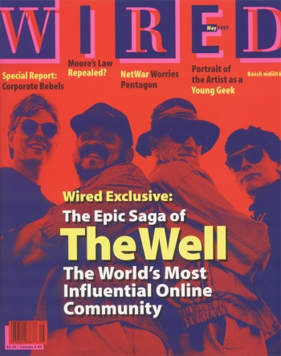
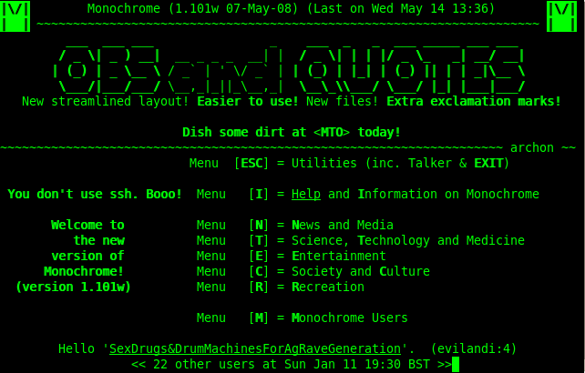
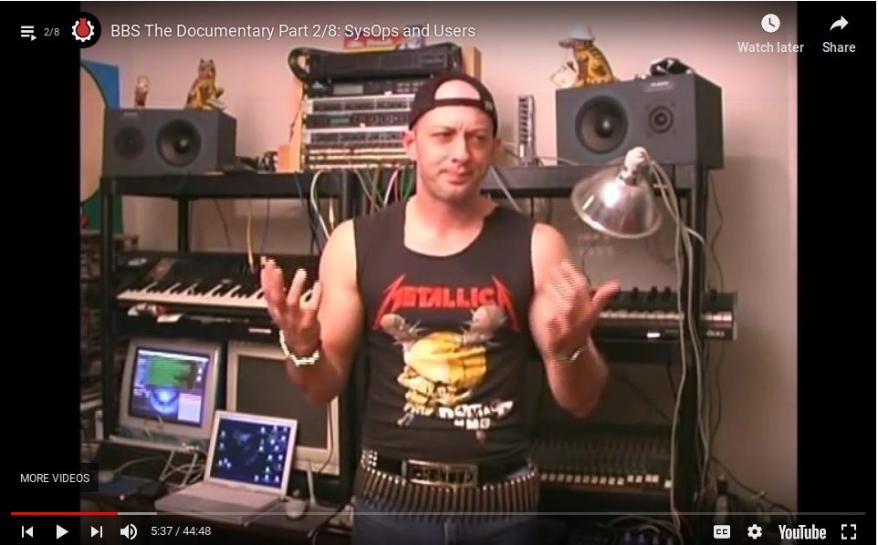
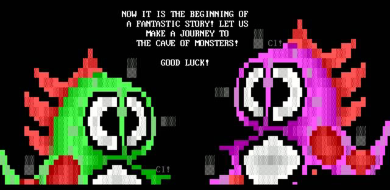
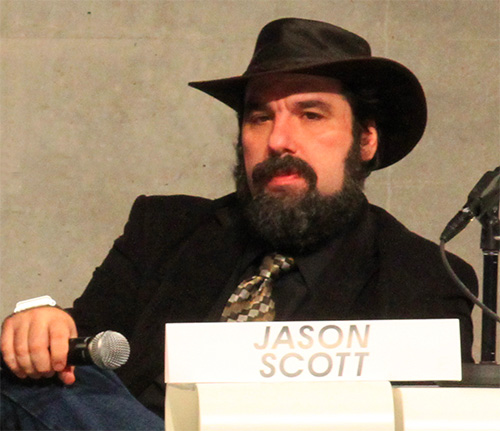
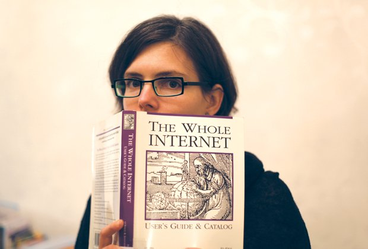

# Online Communities

> life will be happier for the on-line individual because the people with whom one interacts most strongly will be selected more by commonality of interests and goals than by accidents of proximity

Licklider,J.C.R., Robert W. Taylor. The Computer as a Communication Device. Science and Technology. 1968.

## Phone Phreaking

"In 1957, Joe Engressia first realized that he could control the phone system and make long-distance phone calls at no cost by whistling a specific pitch down the phone line. The AT&T phone network used twelve combinations of six audio tones as control signals. Engressia's whistles through the mouthpiece were interpreted as the phone company's own control tones. Engressia was one of a scattered group of technologically curious teenagers across the United States who spent their free time experimenting with controlling the phone system. These kids called themselves "phone phreaks." Many were blind and were to some extent socially isolated among kids their own age. It was the phreaks, however, who first liberated themselves from reliance on their proximate peers. Theirs would be a community drawn together by the attraction of common interest rather than the strictures of geography."

Ryan, Johnny. A History of the Internet and the Digital Future. Reaktion Books. 2010.

## The WELL

"The WELL is a cherished destination for conversation and discussion. It is widely known as the primordial ooze where the online community movement was born — where Howard Rheingold first coined the term "virtual community." Since long before the public Internet was unleashed, it has quietly captivated some accomplished and imaginative people. Over the last two and a half decades, it's been described as "the world's most influential online community" in a Wired Magazine cover story"

from [The WELL home page](https://www.well.com/about-2/)

"Life and death was shared in intimate detail online. The birth of the first baby of a Well member was celebrated in 1986; the first marriage between two members occurred in 1988; and the first death of a member, Blair Newman, was mourned in 1990. By 1995, the community had become so intimate that Tom Mandel, dying of cancer, bid his peers on The Well farewell with a depth of emotion rarely expressed in public:

> I'm sad, terribly sad, I cannot tell you how sad and grief stricken I am that I cannot stay to play and argue with you much longer. It seems almost as if I am the one who will be left behind to grieve for all of you dying...

Ryan, Johnny. From the first e-mail through the WELL and USENET: a pre-history of social networking. Ars Technica. 2011.

## BBS && the ANSI ArtScene

A bulletin board system, or BBS, is a computer system running software that allows users to connect and log into the system using a terminal program. Once logged in, a user can perform functions such as uploading and downloading software and data, reading news and bulletins, and exchanging messages with other users, either through email, public message boards, and sometimes via direct chatting. Many BBSes also offer on-line games, in which users can compete with each other, and BBSes with multiple phone lines often provide chat rooms, allowing users to interact with each other. [wikipedia](https://en.wikipedia.org/wiki/Bulletin_board_system)

> This is brilliant, this is amazing, this is fantastic, I can talk to someone through a computer without seeing them. They don't have to see me, I don't have to see them, we just talk.

to check out what a BBS would have looked like, launch your terminal app and type in `telnet 1984.ws 23`

there where no photos or videos, it was all text-based, YouTube would have looked like this: `telnet towel.blinkenlights.nl 23` and here's a [simulation](https://www.masswerk.at/googleBBS/) of what google would have looked like if it was around in the BBS days.

Even though these BBSs could only display text, users realized that they could create “art” by creatively placing ASCII and ANSI characters on a screen. A subculture of early computer “outsider” (not affiliated with established fine art institutions) artists flourished in the 80s. These artists would usually go by aliases or “handles” (because of their involvement with the early computer piracy communities or “warez scene”) and would work in groups known as “crews.”

# Communities on the World Wide Web

[Jason Scott](http://www.textfiles.com/jason/) && his [archive team](https://www.archiveteam.org/index.php?title=Main_Page) have saved lots of online folk-cultural works from extinction. The most popular of which (in our net art circles) is 1TB worth of geocities pages which they archived as a torrent. Spend a few minutes perusing through [One Terabyte of Kilobyte Age](http://blog.geocities.institute/) (the geocities research blog lead by net artists [Olia Lialina](http://art.teleportacia.org/olia.html) && Dragan Espenschied editors of the [DIGITAL FOLKLORE Reader](http://digital-folklore.org/) ), You can read more about Olia's ideas on this subject in her essays [A Vernacular Web](http://art.teleportacia.org/observation/vernacular/) and [A Vernacular Web 2](http://contemporary-home-computing.org/vernacular-web-2/)

> Most of us think nothing of putting our lives in the cloud; photos in Flickr, videos on YouTube, most everything on Facebook. But what about when those services abruptly go away, taking all of our collective contributions with them? Well Jason Scott operates on the assumption that everything online will one day disappear. He explains to Bob why he and the Archive Team are dedicated to saving user-generated content for posterity

[On The Media](http://www.onthemedia.org/people/jason-scott)

The free web hosting service Geocities.com was founded by “Beverly Hills Internet” in July 1995 — exactly the time when the web left academia and started to be made by everyone of us. Soon it became one of the most popular and inhabited places of the WWW and stayed that way through the second part of 1990’s. In January 1999, on the peak of Dot.com mania, it was bought by Yahoo!. The new millennium proved Geocities to be a bad investment. Having a page on there became a synonym for dilettantism and bad taste. Furthermore, the time of personal home pages was counted, being replaced with profiles on social networks. Ten years later, in April 2009, Yahoo! announced that they are going to shut down the service. On the 26th of October 2009 Geocities seized to exist. In between the announcement and the official date of death a group of people calling themselves Archive Team managed to rescue almost a terabyte of Geocities pages. On the 26th of October 2010, the first anniversary of this Digital Holocaust, the Archive Team started to seed geocities.archiveteam.torrent.

## a note on "netizens"

> "There are people online who actively contribute towards the development of the Net. These people understand the value of collective work and the communal aspects of public communications. These are the people who discuss and debate topics in a constructive manner, who e-mail answers to people and provide help to new-comers, who maintain FAQ files and other public information repositories, who maintain mailing lists, and so on. These are people who discuss the nature and role of this new communications medium. These are the people who as citizens of the Net, I realized were Netizens."

Hauben, Michael and Ronda Hauben. Netizens: On the History and Impact of Usenet and the Internet. New York and Beppu. 1995.

