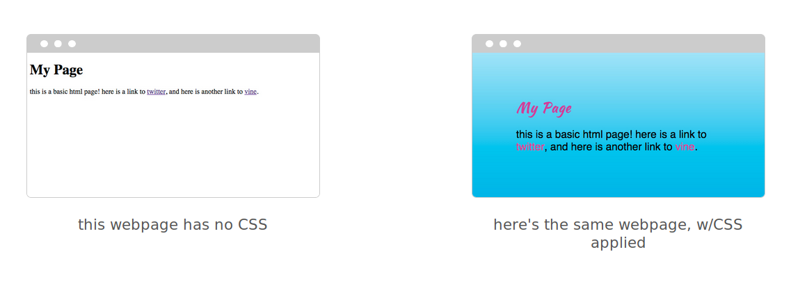
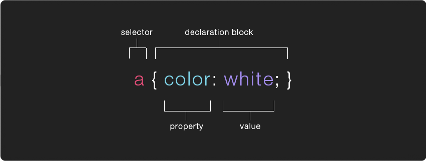
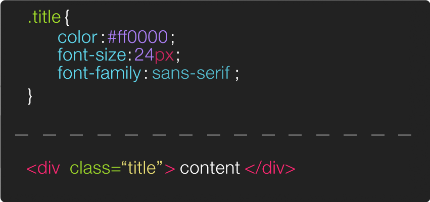

# Cascading Style Sheets (CSS)

The point of CSS (Cascading Style Sheets) is to separate “presentation” (CSS) from “content” (HTML). The separation of a document’s content and its presentation is a popular tech-design philosophy/methodology. It means you can display the same content (HTML) in different ways (w/different styles) for different contexts: laptops, smart phones, in print, on a braille tactile device, etc. It also means a text-to-speech app can understand what’s “content” && what’s not and reader-views/apps can override the default CSS and use alternative “presentations”. Depending on how you implement your CSS, it also enables you to make site-wide changes in a single document which can make updating (even redesigning the entire aesthetic) a site drastically easier.



## CSS Rules: selectors and declarations

A CSS "rule" (colloquially referred to as a CSS “class”) contains two parts, a **selector** which specifies which element(s) the rules will be applied to and a `{` **declaration block** `}`, surrounded by curly brackets, which specifies how the element should be styled.

The declaration is split in two parts, the **property** which indicates the aspect of the element you want to change (ex: color, font, width, border) and the **value** which is the setting you want to use for that specific property.



The example above uses a type selector, which means it will apply the rules to every `<a>` tag on the page. You can apply the same rule to multiple elements by including them in a comma separated list with in the selector. For example `h1, h2, h3 { color: purple; }` will change the color of all the `<h1>`, `<h2>` and `<h3>` tags on the page to purple.

There are many other [kinds of selectors](https://www.sitepoint.com/css-selectors/) which give you different ways of targeting specific elements to apply your CSS rules to. The most common selector is likely to be the class selector which targets any element whose class attribute’s value matches that of the class name.



Selectors can also be followed by pseudo-classes, which specify a particular “state” the element can be in. The example below shows a very common use of the `:hover`pseudo-class.


Similarly, selector’s can also be followed by pseudo-elements ( :: instead of : ), rather then specify a special state, pseudo-elements target a specific part of the targeted element, for example `p::first-letter { font-size:32px; }` will make the first letter of every `<p>` element 32px. A [full list of pseudo-classes is available](https://developer.mozilla.org/en-US/docs/Web/CSS/Pseudo-classes) on the mozilla developer network as well as a [full list of pseudo-elements](https://developer.mozilla.org/en-US/docs/Web/CSS/Pseudo-elements). You can also find a list of every CSS selector and property in CSS-Tricks.com's [almanac](https://css-tricks.com/almanac/).

## Adding CSS to your HTML page

#### Inline Styles

There are three different ways to incorporate CSS code to your site, the first is inline, which is generally discouraged. With this method you don’t write a selector, instead you type CSS properties and values directly into the HTML tag as a value of its style attribute. This can be helpful when trying to hack around some peculiar situation.

```HTML
	<div style="font-size:24px;color:white;"> hello there! </div>
```

#### Internal CSS

The second way to include CSS rules is internally, via `<style>` tags (which go inside the head). Though it’s generally best to use the third method (external stylesheet), there are times where you might need to apply a CSS class to only one page on your site or you might have a simple single-page website and want to cut down on requests to the server by keeping all the code in a single HTML file.

```HTML
  <head>

    <style>
      /* CSS code could go here */
    </style>

  </head>
```
#### External CSS

The third approach of an external (or linked) stylesheet is generally considered the best-practice. Here we write all our CSS rules in a separate document (known as a stylesheet) saved with a `.css` and then attached (or included) in the head of your HTML page via a `<link>` tag. The link tag needs to include two attributes, an href with the path to your `.css` file and a rel with the value of stylesheet, this specifies the “relationship” between the page and the file being linked to (this is important because there are other files you might want to link to with a different relationship to the page, for example a favicon).

```css
  /*
	   assuming this is inside a file called "styles.css"
	   which is inside a folder called "css"
	*/
	a {
		color: #ff00ff;
		text-decoration: none;
	}

	.info {
		font-family: sans-serif;
		font-size: 12px;
		color: #555;
	}
```

```html
<!-- assuming this is in an html file -->
	<head>
		<link href="css/styles.css" rel="stylesheet">
	</head>
```

You often see a third attribute in link tags, the type attribute. When linking to a stylesheet the type should be set to “text/css” (but these days this isn’t really necessary). You can link more than one stylesheet to your page, developers often do this in order to keep their stylesheets modular.
