# Copy + Paste

> the act of creation is surrounded by a fog of myths. myths that creativity comes via inspiration, that original creations break the mold, that they are the products of geniuses, and appear as quickly as electricity can heat a filament. But creativity isn’t magic. it happens by applying ordinary tools of thought to existing materials, and the soil from which we grow our creations is something we scorn and misunderstand even though it gives us so much, and that’s copying.

Ferguson, Kirby. Everything is a Remix. 2011.

##  in Praise of Copying

> "Start copying what you love. Copying, copying, copying. And at the end of the copy, you will find yourself."

Yohji Yamamoto

> "Most artists are brought to their vocation when their own nascent gifts are awakened by the work of a master. That is to say, most artists are converted to art by art itself."

Hyde, Lewis. the Gift: Creativity and the Artist in the Modern World. Vintage. 1983.

Copying is how we learn art. For example, while working for Time Magazine, Hunter S. Thompson used a typewriter to copy F. Scott Fitzgerald's The Great Gatsby and Ernest Hemingway's A Farewell to Arms in order to learn about the writing styles of the authors.

[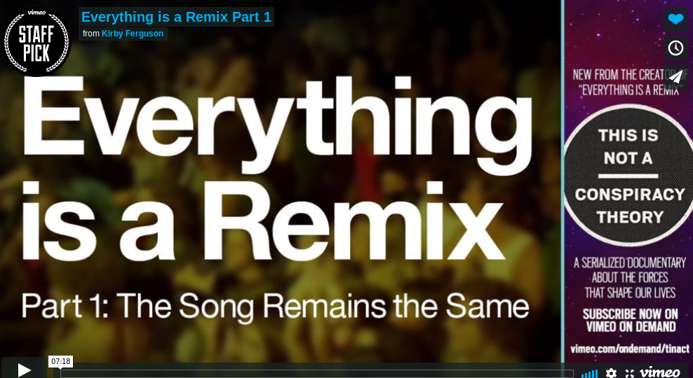](https://vimeo.com/14912890)

[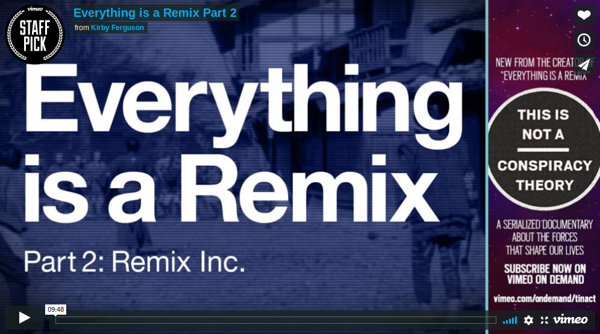](https://vimeo.com/19447662)

## Genius and the Truth About Innovation

> ’Authorship’ – in the sense we know it today, individual intellectual effort related to the book as an economic commodity – was practically unknown before the advent of print technology [...] the invention of printing did away with anonymity, fostering ideas of literary fame and the habit of considering intellectual effort as private property. Mechanical multiples of the same text created a public – a reading public [...] the idea of copywrite [...] was born

McLuhan, Marshall. The Medium is the Massage: An Inventory of Effects. Gingko Press. 1967.

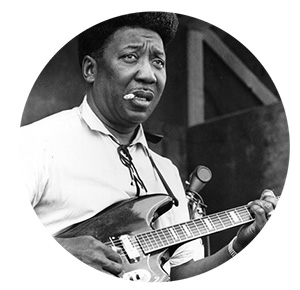
[Muddy Waters Interview](http://piraticalpractices.net/lectures/waters.mp3)

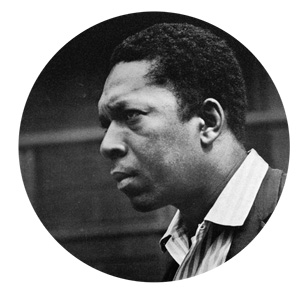
[John Coltrane  Interview](http://piraticalpractices.net/lectures/coltrane.mp3)

> A genius is a genius, Simonton maintains, because he can put together such a staggering number of insights, ideas, theories, random observations, and unexpected connections that he almost inevitably ends up with something great. “Quality,” Simonton writes, is “a probabilistic function of quantity.”

Gladwell, Malcolm. [Creation Myth. Xerox PARC, Apple and the truth about innovation.](https://www.newyorker.com/magazine/2011/05/16/creation-myth) the New Yorker. 2011.

[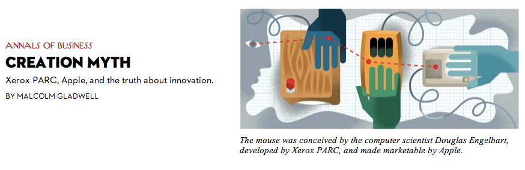](https://www.newyorker.com/magazine/2011/05/16/creation-myth)

[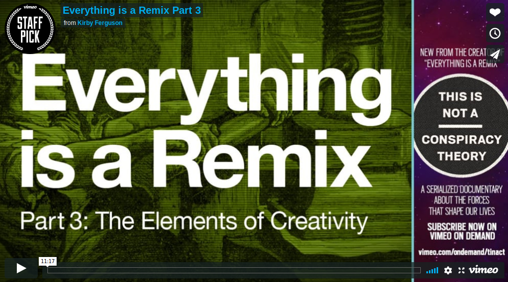](https://vimeo.com/25380454)

##  Multiple Discovery && Undiscovered Public Knowledge

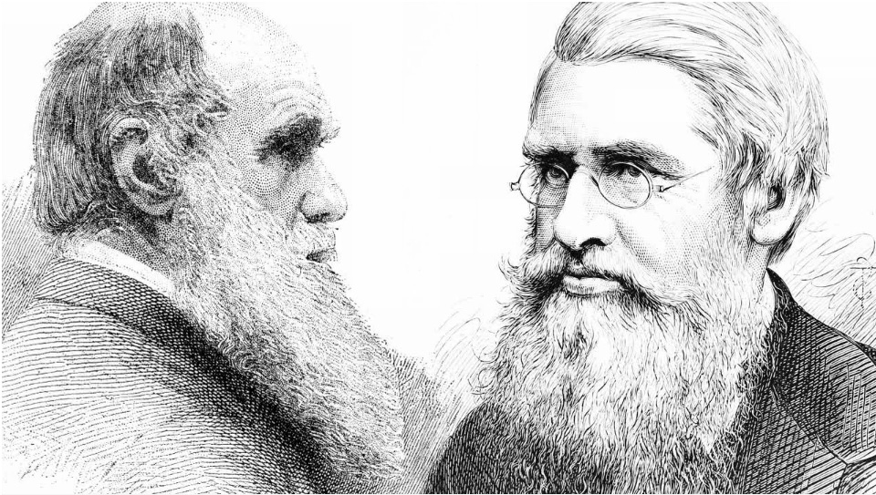

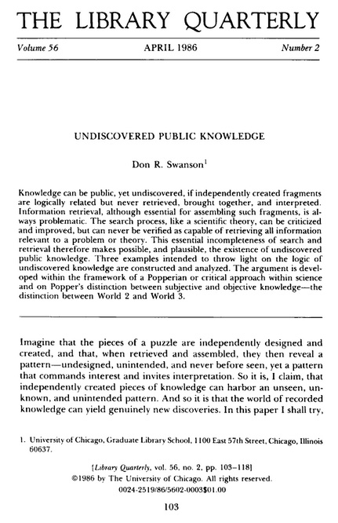

[Don R Swanson](http://www.jstor.org/discover/10.2307/4307965?uid=3739656&uid=2&uid=4&uid=3739256&sid=21101776714977)

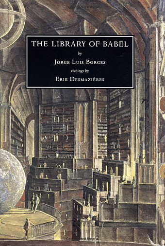

[the Library of Babel by Jorge Borges](http://en.wikipedia.org/wiki/The_Library_of_Babel)

> I invented nothing new. I simply assembled the discoveries of other men behind whom were centuries of work... progress happens when all the factors that make for it are ready and then it is inevitable.

Henry Ford

##  Cryptomnesia

>
"Does it ring a bell? The first-person narrator, a cultivated man of middle age, looks back on the story of an amour fou. It all starts when, traveling abroad, he takes a room as a lodger. The moment he sees the daughter of the house, he is lost. She is a pre-teen, whose charms instantly enslave him. Heedless of her age, he becomes intimate with her. In the end she dies, and the narrator marked by her forever remains alone. The name of the girl supplies the title of the story ..."

## Copyright

The notion that copyright is a natural right transcribed into law in the interest of protecting cultural producers is empirically false, it is not now, nor has it ever been, centered on creators. Intellectual property was an idea invented in the late 16th century during the English after the invention of the printing press (and [the subsequent printing industry](https://en.wikipedia.org/wiki/Worshipful_Company_of_Stationers_and_Newspaper_Makers)), the [Reformation](https://en.wikipedia.org/wiki/Reformation), a product of England’s ruptures with the Catholic Church and the [English Civil War](https://en.wikipedia.org/wiki/English_Civil_War). All of this amidst the [Enlightenment](https://en.wikipedia.org/wiki/Age_of_Enlightenment)’s bent towards individualism. Today the invention of intellectual property is justified as a necessary ([though embarrassing](http://press-pubs.uchicago.edu/founders/documents/a1_8_8s12.html)) compromise: in the interest of sustaining a rich [public domain](https://en.wikipedia.org/wiki/Public_domain) (from which society benefits immeasurably) the state incentivises cultural producers by granting them limited time monopoly of use, after which point the work enters the public domain. But to believe copyright is about “protection” is to miss the point. Copyright is, and has always been, about control.

*Curious to learn more about the history of Copyright Law? Check out Adrian Johns book [Piracy: The Intellectual Property Wars from Gutenberg to Gates](https://www.press.uchicago.edu/ucp/books/book/chicago/P/bo8273977.html)*

[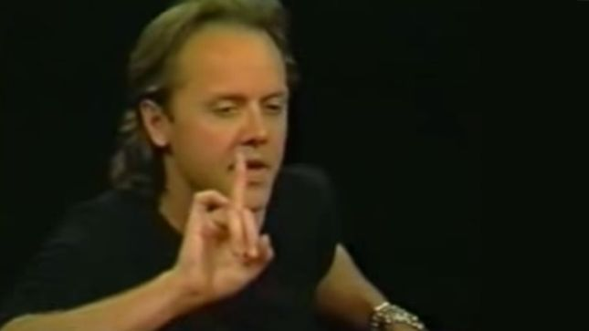](http://piraticalpractices.net/syllabus/videos/chuckLars.mp4)

> Nearly any commons, though, can be encroached upon, partitioned, enclosed. The American commons include tangible assets such as public forests and minerals, intangible wealth such as copyrights and patents, critical infrastructures such as the Internet and government research, and cultural resources such as the broadcast airwaves and public spaces. They include resources we’ve paid for as taxpayers and inherited from previous generations. [...] Honoring the commons is not a matter of moral exhortation. It is a practical necessity. We in Western society are going through a period of intensifying belief in private ownership, to the detriment of the public good. We have to remain constantly vigilant to prevent raids by those who would selfishly exploit our common heritage for their private gain. Such raids on our natural resources are not examples of enterprise and initiative. They are attempts to take from all the people just for the benefit of a few.

> [...] few of us question the contemporary construction of copyright. It is taken as a law, both in the sense of a universally recognizable moral absolute, like the law against murder, and as naturally inherent in our world, like the law of gravity. In fact, it is neither. Rather, copyright is an ongoing social negotiation, tenuously forged, endlessly revised, and imperfect in its every incarnation. [...] The first Congress to grant copyright gave authors an initial term of fourteen years, which could be renewed for another fourteen if the author still lived. The current term is the life of the author plus seventy years. It’s only a slight exaggeration to say that each time

Lethem, Jonathan. (paraphrasing Bollier then Lessig). [The Ecstasy of Influence: A plagiarism.](https://harpers.org/archive/2007/02/the-ecstasy-of-influence/) Harpers Magazine. Feb 28, 2018:

[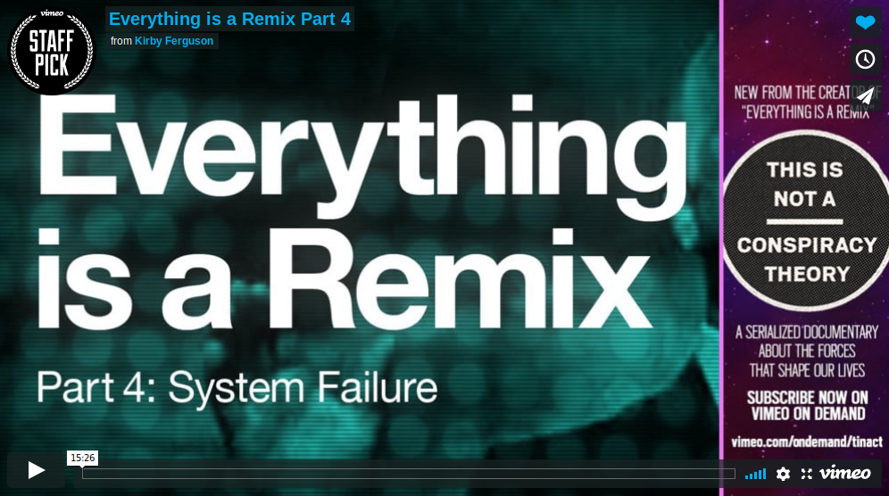](https://vimeo.com/36881035)
