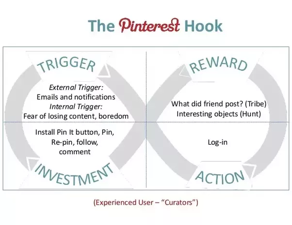

# Privacy

"I've got nothing to hide..."

> Like many fundamental rights, privacy is one of those things that becomes noticed only when it’s gone. That’s unfortunate, because after it’s gone it’s much harder to regain. We have to stop the slide. Fundamentally, the argument for privacy is a moral one. It is something we ought to have—not because it is profitable or efficient, but because it is moral. Mass surveillance should be relegated to the dustbin of history, along with so many other practices that humans once considered normal but are now universally recognized as abhorrent. Privacy is a human right.

— Bruce Schneier form [Data and Goliath: The Hidden Battles to Collect Your Data and Control Your World](https://www.schneier.com/books/data_and_goliath/)

## Government Surveillance

> A society in which people can be monitored at all time, is a society that breeds conformity and obedience and submission. Which is why every tirent, [from] the most overt to the most subtle, craves that system. Conversely, even more importantly, it is a realm of privacy, the ability to go somewhere where we can think, and reason and interact and speak without the judgmental eyes of others being cast upon us, in which creativity and exploration and decent exclusively reside.

— Glenn Greenwald

## Corporate Surveillance

At the crossroads of [Moore's law](https://en.wikipedia.org/wiki/Moore's_law) and [Metcalfe's law](https://en.wikipedia.org/wiki/Metcalfe's_law) enable us to do things today that were previously impossible, limited by processing power, storage and bandwidth, that all changed a few years ago.

On the subject of the prevailing tech business model today, as the saying goes, "when something is free, you're not the customer, you're the product." The vitamins vs painkiller question:

> A habit is when not doing an action causes a bit of pain. It is important to clarify that the term pain, as it is frequently used in business school and marketing books, is somewhat hyperbolic. In reality, the experience we are talking about is more similar to an itch, a feeling that manifests within the mind and causes discomfort until it is satisfied. The habit-forming products we use are simply there to provide some sort of relief. Using a technology or product to scratch the itch provides faster satisfaction than ignoring it. Once we come to depend on a tool, nothing else will do. My Answer to the vitamin versus painkiller question: Habit forming technologies are both. These services seem at first to be offering nice-to-have vitamins, but once the habit is established, they provide an ongoing pain remedy.

— Nir Eyal from [Hooked: How to Build Habit-Forming Products](https://www.goodreads.com/book/show/22668729-hooked)

Tech companies used to record data to improve a product or service for the user they were recording data from. Take mouse movements for example. These could be recorded to do usability testing, researchers could analyze the data to see if a user was confused or missed an important part of an app or site. Today data is collected and used in various other ways that aren't necessarily geared towards improving the product for the users, but rather for the new customer, the folks who want the users attention, advertising:

> Algorithms find patterns shared by different users, based on their online behavior. This goes beyond their ocmmon interests to include things like the time, location, and other context elements of web activity. If User A does a dozen things online prior to buying a car—many of them unrelated to buying a car—the algorithm will look for other users who start down the same path and then off them ads to buy a car.

— Roger McNamee (Investor and former Facebook adviser)

Today, thanks to Machine Learning algorithms, comparing data across lots of users patterns can be found which are used to make unprecedented predictions and even manipulate our behavior. Consider what we can do with [mouse movement data](https://dl.acm.org/citation.cfm?doid=1029208.1029210) today. Your mouse movements are only one piece of the puzzle, data brokers (for whom buying and selling user data is their business) can have up to 400 data points on each individual.

# What to do about it
## How-To Guide to Privacy

**NOTE** ...the notes below are from a workshop I give, and need to be updated, take notes in class as we'll likely discuss these updates + alternatives...

just like there’s no universal outfit—no *one-size-fits-all* multi-climate, multi-occasion, aesthetically objective attire—there is also no universal solution to the data/privacy issue. **the key is understanding how things work** ( the Internet, computers, [meta]data, encryption, etc. ), so u can be informed enough to make the right digital decisions, sometimes that’s using the right tools ( like encryption ) other times it’s even more basic than that ( like not submitting personal information to any website that isn’t HTTPS… especially if u're in a cafe ). that said, i’ve listed out some long-term + short-term solutions, but keep in mind that ultimately fundamental digital literacies are a prerequisite for using all the tools right && making informed decisions based on ur own personal situation.

### long-term solutions

the tools + best practices listed in the sections below are great ways to handle the issue right now, but ultimately these are short term solutions—we should also be working towards long term solutions. we need to organize && work against the factors undermining the normalization of privacy/security + user owned/controlled data: our governments && the corporations behind the ubiquitous platforms we depend on. governments need to prioritize our rights over corporate interests && the government's own perverse interest in mass surveillance && control. we need to build a consumer demand for products/platforms that prioritize privacy, security && user agency w/re:to our data. to reiterate, this is the longer term solution && is obviously easier said than done, but we can work towards this by:

* staying informed, reading any/all articles ( from reputable sources ) about privacy, data && security. go out of our way to read great books on these issues as well ( like the ones in the end notes ).

* actively share these articles/books + other work w/others, start conversations. talk about these issues on a regular basis with family + friends. make work about these issues. make the issues visible.

* normalize the use of privacy enabling tools by using them even if u don’t think u have anything to hide ( because so many others do ).

* donate to public interest groups ( like the [EFF](https://eff.org) && others ) who work towards lobbying government && pressuring corporations. support activists. support journalists. support companies that make it a point to adopt ethical standards && seek new business models.

### short-term solutions

there are plenty of amazing tools that offer fantastic short term solutions to these issues. some of these tools/techniques might seem “inconvenient” but that’s something we have to accept. the amount of agency we’ve lost as netizens is in large part due to our appetite for convenience at any cost. it’s true that it would be easier for us to login to our social media by only putting in our usernames && not having to remember a password ( ugh, how inconvenient ) but the alternative ( allowing anyone who knows our username to access our accounts ) is clearly too risky.

#### addressing the "tracking" issue

* block trackers: [Privacy Badger](https://www.eff.org/privacybadger) + [uBlock](https://www.ublock.org/) + [Ghostery](https://www.ghostery.com/)

* block "browser fingerprinting": [noscript](https://noscript.net/)

* search engine: [DuckDuckGo](https://duckduckgo.com/)

* browsers: [Firefox](https://www.mozilla.org/en-US/firefox/new/) for desktop + [Firefox Focus](https://itunes.apple.com/app/id1055677337) or [DuckDuckGo](https://duckduckgo.com/app) for mobile

* VPN: [IPVanish](https://www.ipvanish.com/en/?a_aid=thewarlock&a_bid=d24399c2&chan=vpnu) + [ExpressVPN](https://www.expressvpn.com/), [TorGuard](https://torguard.net/) + [AirVPN](https://airvpn.org/plans/) + pretty soon [ProtonVPN](https://protonvpn.com/)

* TOR: [mainsite](https://www.torproject.org/) >> [TOR Browser](https://www.torproject.org/projects/torbrowser.html.en) && [Tails](https://tails.boum.org/) (routes all Internet traffic through TOR)

#### communicating privately

* video conferencing: [Jitsi Meet](https://jitsi.org/Projects/JitsiMeet)

* phone conversations: [Signal](https://whispersystems.org/#page-top)

* text messaging: [Signal](https://whispersystems.org/#page-top) (WhatsApp && iMessages are also *encrypted*)

* desktop chatting: [keybase](https://keybase.io/) +  [Signal](https://whispersystems.org/blog/signal-desktop/) + [Semaphor](https://spideroak.com/personal/semaphor) (slack alternative)

* file sharing: [OnionShare](https://onionshare.org/) + [Semaphor](https://spideroak.com/personal/semaphor) + [keybase](https://keybase.io/)

* email: [ProtonMail](https://protonmail.com/) or just use PGP  w/any email service ( [this video](https://youtu.be/S4HP1pRTE3A) shows u how to do that using keybase 7& a plugin called [mailvelope](https://www.mailvelope.com/en) )

### best practices

 

**Where is ur stuff stored?** If u have stuff stored in “the cloud” remember that “the cloud” is really just someone else’s computer. i’m specifically referring to cloud services like Google Drive, DropBox, iCloud etc. && not necessarily the cloud servers we setup ourselves.

anytime u use a 3rd party cloud service to store any data u should ask urself: do i trust this company? how does this company make money? is that in conflict w/my personal interests? are things auto-syncing or do i control when things get uploaded? are there other important aspects/functionality i do/don't have control over? have i read their Privacy Policy (or read credible sources who discuss their privacy policy)? these can be overwhelming but check out [this guide to social media privacy policies](https://myshadow.org/lost-in-small-print) && [this guide to terms of services](https://tosdr.org/) for a friendlier breakdown.

Anytime u have data stored on ur own devices ( phone/laptop ) consider encrypting ur files. There are different tools on different platforms for encrypting ur entire hard drive, some platforms do it by default when u create a login password. Consider encrypting sensitive files with strong encryption tools like PGP.

 

we carry our phones with us everywhere, **don’t forget our phones are tracking devices** (if they don’t track u they can’t work). if u ever want to be somewhere privately don’t take ur phone ( or stick it in a [faraday case](https://www.amazon.com/faraday-bag/s?ie=UTF8&page=1&rh=i%3Aaps%2Ck%3Afaraday%20bag) ).

 

just because ur phone needs to know where u are in order for calls/texts to work, doesn’t mean every app needs to know where u are at all time. check ur phones location settings && consider which apps really need to know where u are. ( this includes the operating systems iOS && Android themselves )

 

in order to connect to WiFi networks or Bluetooth devices our phones are constantly broadcasting information about us out in the open. when u’re not actively using wifi or a bluetooth device keep those features turned off ( it’ll also save a bit of battery life ). also consider deleting ur WiFi history from time to time.

 

**Careful what u click on.** even emails sent from a friend can have malicious attachments. don’t download anything u’re not 100% sure of ( send ur friend a text message confirming they really meant to send u that weird looking email )

 

**Careful what u sign up for.** ask urself, do i really need to be on this new app/site? if so think about how much information u share with that site ( do u need to use ur real name? do u need to fill out all the info? ). regularly review the privacy settings on any social media accounts u have, these can change + the defaults often have the company’s best interest in mind, which often isn't the same urs.

 

**Don’t leave ur laptop or phone unattended.** it could get stolen or compromised ( all it takes if 5 seconds && a USB stick )

 

**Do u trust the network ur on?** when ur at home u own the Wifi ( && likely u setup ur router ), but when ur at a cafe or elsewhere remember that everything u do could potentially be seen by anyone else on that network. using encrypted tools will hide ur content from others on the network ( but not the metadata ). && never typeout any personal/sensitive information into any website that isn’t HTTPS (consider installing [HTTPSEverywhere](https://www.eff.org/https-everywhere) ).

 

**look for open-source alternatives.** there are tons of benefits to using open-source software ( it's usually free, community developed && xtremely customizable ) but one major one is that when the source-code is open to the public it's made available for security auditing, this is the only way to be sure a piece of software is really safe. proprietary software is a black box, only that company can see the code && again we're left to ask: do i trust this company?

 

**Use strong passwords!!!** for real! You’re probably not, do it now! here’s what to consider:

 * make them long, don't ever make them less than 12 characters, but probably more

 * don't make it personal, people who want to crack ur password are usually good at guessing

 * speaking of personal, beware of "Security Questions", don't make those personal either... think about it

 * Make it complex, random numbers && letters are best! but if u're not good at remembering those at least a random passphrase like: *pizzahandlerugbucketsauce*

 * don't use the same password for more than one site ( yes seriously )

 * keep it secret ( obviously good advice, yet so often ignored )

 * change ur passwords every-now && again, at least once a year

 * it's impossible to memorize lots of strong passwords, so use a password manager like [LastPass](https://www.lastpass.com/) + [1password](https://1password.com/) + [KeePass](http://keepass.info/) or [KeePassX](https://www.keepassx.org/)

 * Consider using two-factor authentication when it's offered

 ### references

* this is a great introduction to the history && theory of cryptography >> Singh, Simon. "The Code Book: The Science of Secrecy from Ancient Egypt to Quantum Cryptography". Anchor. 2000.

* this is proably the best book about the state of data/privacy/surveillance today by one of the world's foremost experts on the subject >> Schneier, Bruce. "Data and Goliath: The Hidden Battles to Collect Your Data and Control Your World". W. W. Norton & Company. 2015.

* here's a few more rad "privacy-guides" by some great orgs:

	* [A DIY Guide to Feminist Cybersecurity](https://hackblossom.org/cybersecurity/)

	* EFF's [Surveillance Self-Defense](https://ssd.eff.org/en)

	* [Me and My Shadow](https://myshadow.org/)

	* [Security in a Box](https://securityinabox.org/en/)

* here are a few articles/references for some of the points made during the "Why" discussion:

	* information we don't even know we're sharing ( [Note to Self:the Bookie](https://www.wnyc.org/story/fourth-amendment-privacy/) ~17:20 )

	* Facebook's [sponsored posts](http://readwrite.com/2012/12/11/why-are-dead-people-liking-stuff-on-facebook/) and stories (**depreciated**)

	* Facebook's [troubling](https://www.theatlantic.com/technology/archive/2014/06/everything-we-know-about-facebooks-secret-mood-manipulation-experiment/373648/) experiments && their ["Trust Engineers"](http://www.radiolab.org/story/trust-engineers/)

	* Facebook [analyzing what you type](http://articles.latimes.com/2013/dec/17/business/la-fi-tn-facebook-can-track-users-unpublished-posts-20131217) ( even if u don't make the post/comment/message )

	* Facebook [knows ur in a new relationship even if u don't tell them](https://www.gizmocrazed.com/2014/02/facebook-knows-when-youre-about-to-update-your-relationship-status/)

	* [Uber exploiting ur battery data](http://nymag.com/selectall/2016/05/uber-knows-exactly-when-youll-pay-surge-pricing-promises-not-to-use-info-against-us.html)

	* what ur mobile phone provider knows about u ( [project](http://www.zeit.de/datenschutz/malte-spitz-data-retention) + [talk](https://www.ted.com/talks/malte_spitz_your_phone_company_is_watching/citations#t-581079) )

	* [An Experiment in Hiring Discrimination Via Online Social Networks](https://papers.ssrn.com/sol3/papers.cfm?abstract_id=2031979)

	* Tactical Technology Collective on [digital profiling](https://vimeo.com/195500780) + [digital scoring](https://vimeo.com/195501194)
